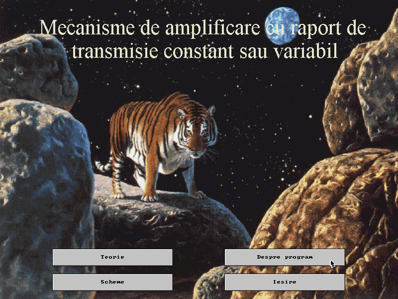
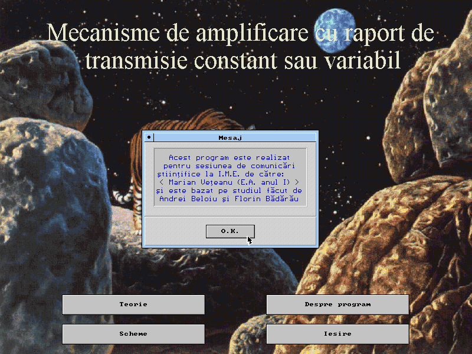
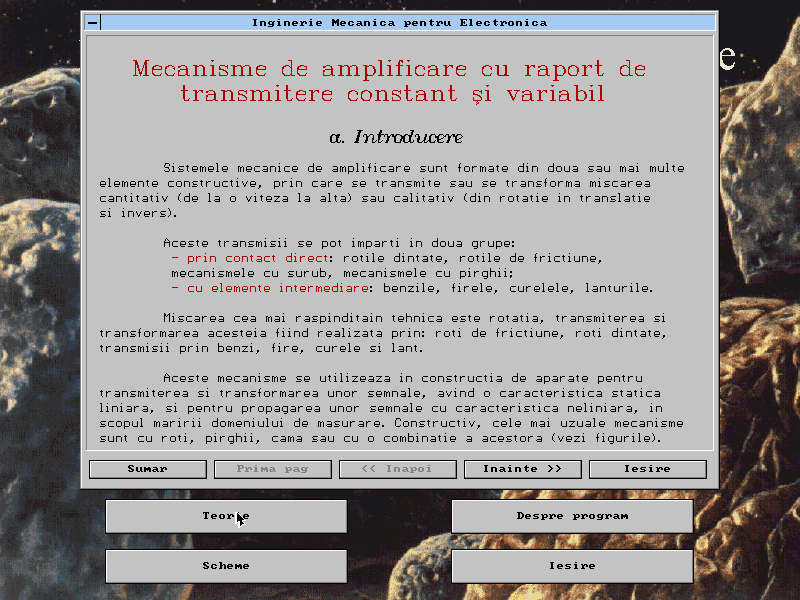
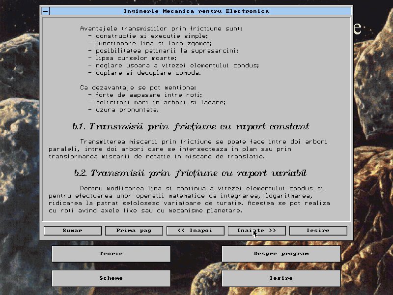
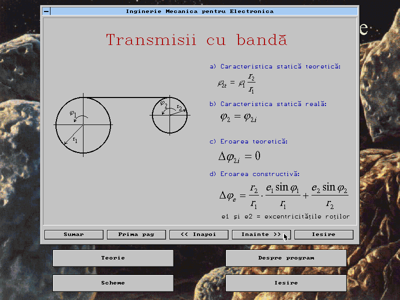
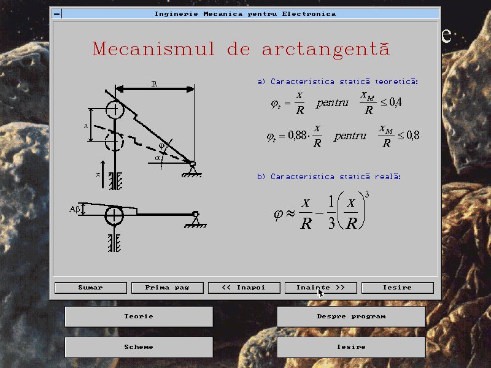
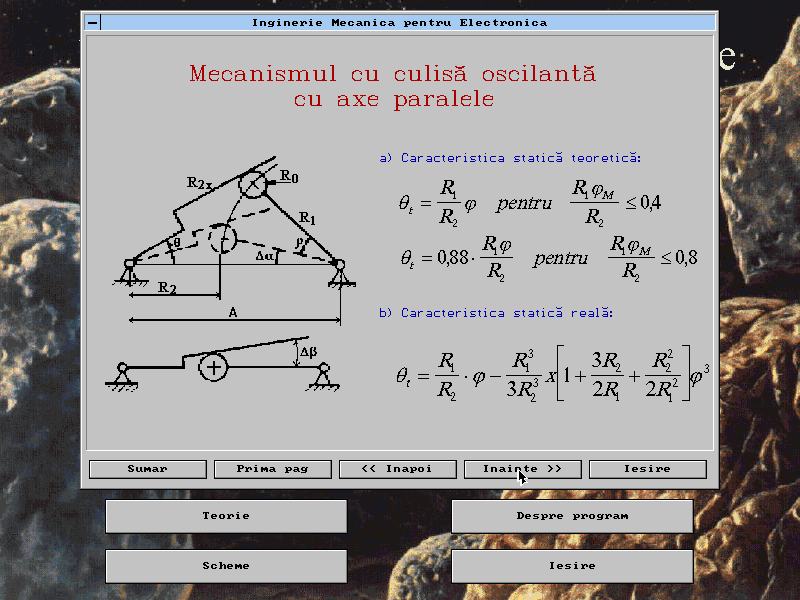
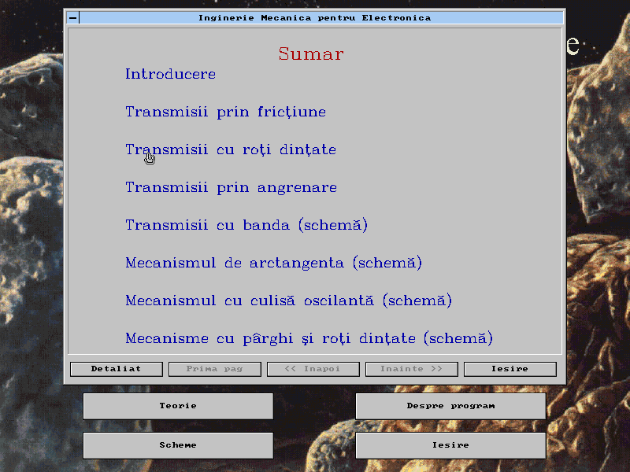
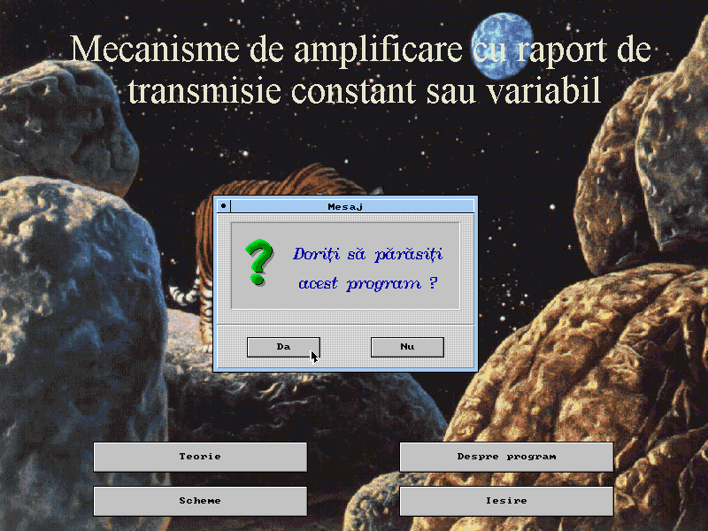

Mecano
=======

Last update: 1996

Mecano is a DOS based GUI oriented educational software for learning about mechanics.

Technology
----------

The technology used for Mecano is the same as the one used for [Physics](https://github.com/mveteanu/Physics).
Both titles are built using the [VMA Win](https://github.com/mveteanu/VMAWin) library for implementing GUI (Windows like) interfaces under DOS.
[VMA Win](https://github.com/mveteanu/VMAWin) library was also developed by Marian Veteanu at VMASOFT.

Features
--------

- SVGA support
- .BMP image support
- mouse support
- hyper-text documents

Screencast
----------

- [http://www.vmasoft.net/mecano.html](http://www.vmasoft.net/mecano.html)

Screenshots
-----------

